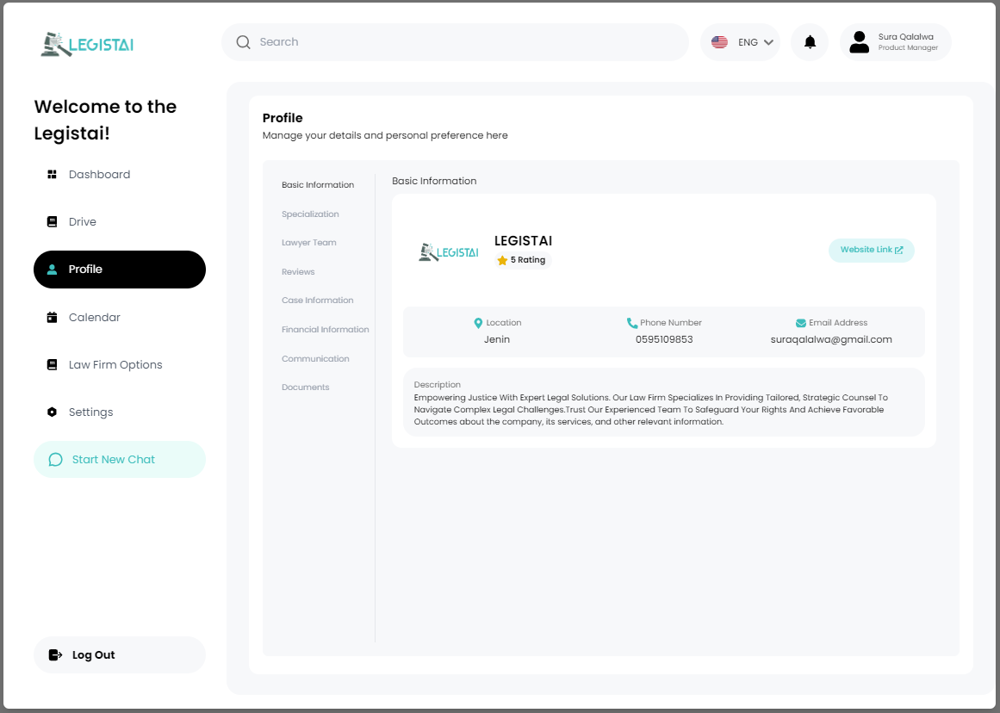
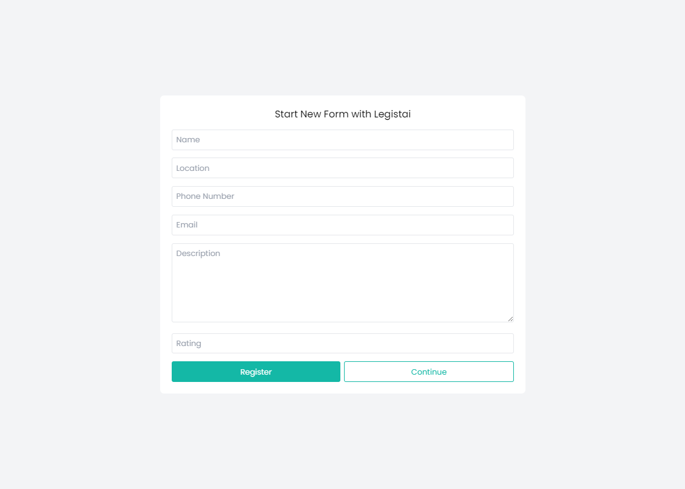

# Legistai Profile Manager


## PROFILE PAGE

<p align="center">
  
</p>

## REGISTRATION PAGE

<p align="center">
  
</p>

## Table of Contents

- [Overview](#overview)
- [Features](#features)
- [Technologies Used](#technologies-used)
- [Getting Started](#getting-started)
- [Usage](#usage)

## Overview

Legistai Profile Manager is a Next.js application that allows users to navigate through various sections such as Dashboard, Drive, Profile, Calendar, and Law Firm settings via a sidebar. The application fetches and displays user data based on the dynamic id parameter passed in the URL.

The application is client-side rendered with data fetching through the useEffect hook, which makes API calls to a backend service to retrieve user profile information.

## Features

- **Dynamic Profile Management**: Displays detailed user profile information fetched from an API.
- **Sidebar Navigation**: Easy navigation between different sections of the application.
- **Navbar Navigation**: Easy navigation between different sections of the application.


## Technologies Used

- **Frontend**: Next.js, TailwindCSS
- **Backend**: Flask, SQLAlchemy, Python
- **State Management:** useState, useEffect
- **Database:** Azure SQL Database
- **CORS:** Flask-CORS for handling cross-origin requests

## Getting Started

1. **Clone the repository:**
   ```sh
   git clone <repository-url>
   ```

2. **Navigate to the project directory:**
   ```sh
   cd LegistaiProfileManager
   ```

3. **Set up the backend:**
   - **Activate the virtual environment:**
     ```sh
     .\venv\Scripts\activate
     ```
   - **Install backend dependencies:**
     ```sh
     cd backend
     pip install
     ```

4. **Set up the frontend:**
   - **Navigate to the frontend directory:**
     ```sh
     cd frontend
     ```
   - **Install frontend dependencies:**
     ```sh
     npm install
     ```
5. **Create a .env file in the backend directory with the following environment variables:**
   ```sh
    DATA_BASE_URL=[your-azure-sql-database-connection-url]

6. **Start the backend:**
   ```sh
   python app.py
   ```

7. **Start the frontend:**
   ```sh
   npm run dev
   ```


## Usage

- **Register a New User:** The registration form allows users to create a new account by providing their name, location, phone number, email, description, and rating. Upon successful registration, users are redirected to their profile page.
- **View User Profile:** After registering, users can view their profile, which displays their information fetched from the backend based on their unique user ID.
- **Sidebar Component:** The Sidebar component provides navigation links to different sections of the application, including a logout option.
- **Navbar Component:** The NavBar component includes the company logo, a search bar, a language selector, notification icon, and user profile information.